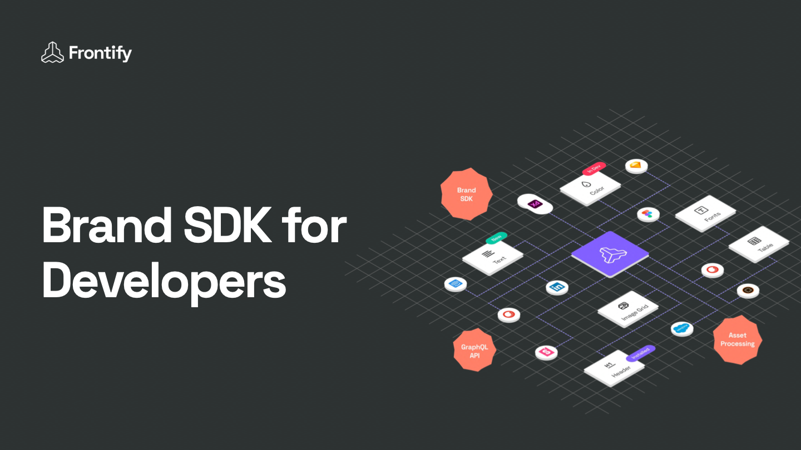

  

# Brand SDK

Brand SDK is a collection of tools and packages for building apps that integrate with Frontify's brand management platform. This repository contains three main packages: Frontify CLI, App Bridge and TypeScript types/helpers packages.

[More information](https://developer.frontify.com/d/xJoA5nhTq1AT/brand-sdk#/getting-started/introduction)

## Frontify CLI

Frontify CLI allows developers to serve apps like Content Blocks in a local development environment. With the CLI, you can easily run and test your app without having to deploy it to Frontify's platform. The CLI also includes commands for building and deploying your app to Frontify's platform.

[More information](https://developer.frontify.com/d/xJoA5nhTq1AT/brand-sdk#/details-concepts/frontify-cli)

## App Bridge

App Bridge is a SDK that allows developers to interact with Frontify and integrate their app with Frontify's platform. The SDK includes methods for making requests to the Frontify API, handling authentication, and managing app data. With App Bridge, developers can access Frontify's platform features and functionality within their own app, providing a seamless user experience for Frontify users.

[More information](https://developer.frontify.com/d/xJoA5nhTq1AT/brand-sdk#/details-concepts/architecture/the-app-bridge)

## TypeScript

The TypeScript packages provides type definitions and helper functions for working with the Frontify CLI and App Bridge. This package is essential for building apps like Content Blocks that integrate with Frontify's platform. The types and helpers included in this package ensure type safety and provide useful functions for working with Frontify's API and platform features.

## More Information

For more information on how to use the Brand SDK, please refer to the documentation on the [Frontify's developer portal](https://developer.frontify.com/d/xJoA5nhTq1AT/content-blocks#/getting-started-1/introduction) for additional resources and support.
